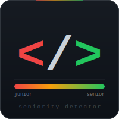

<div align="center">
  
  <h1>seniority-detector</h1>
  <p><strong>¿Eres junior o senior? La IA leyó tu código y dice la verdad.</strong></p>
  <p>
    
    
    
    
    
  </p>
</div>

---

Herramienta CLI que analiza archivos Python — locales o desde GitHub — y clasifica el nivel del desarrollador con un puntaje, señales concretas y recomendaciones accionables.

```
  Archivo: mi_codigo.py

  Nivel:   SENIOR-
  Score:   [#################...] 85/100
  Pylint:  W:1  C:3

  Senales Junior              │ Senales Senior
  ────────────────────────────┼────────────────────────────────
  • print() para depuración   │ • 100% funciones con type hints
  • función de 43 líneas      │ • 100% funciones con docstrings
                              │ • context managers usados
```

## Cómo funciona

El análisis pasa por tres capas antes de llegar al LLM — el modelo recibe datos, no suposiciones:

```
tu_codigo.py
    │
    ├── AST Analyzer ──► métricas estructurales
    │                    (longitud funciones, type hints, variables genéricas...)
    │
    ├── Pylint ────────► hallazgos determinísticos con línea exacta
    │                    (broad-except, missing-docstring, consider-using-with...)
    │
    └── LLM ───────────► nivel + puntaje + señales + recomendaciones
                         (gpt-4o / claude-sonnet)
```

Esto reduce las alucinaciones: el modelo no tiene que adivinar qué está mal, recibe los datos duros del AST y Pylint como contexto.

## Instalación

Requiere [uv](https://docs.astral.sh/uv/getting-started/installation/).

```bash
git clone https://github.com/AndresInsuasty/seniority-detector.git
cd seniority-detector
uv sync
```

Crea un `.env` con tu API key:

```bash
cp .env.example .env
```

```env
# Elige una (o las dos — prioriza Anthropic si tienes ambas)
OPENAI_API_KEY=sk-...
ANTHROPIC_API_KEY=sk-ant-...
```

## Uso

El repositorio incluye dos archivos de ejemplo para probar la herramienta de inmediato:

```bash
# Código con señales junior: variables genéricas, sin type hints, hardcoded paths
uv run detector ejemplos/codigo_junior.py

# Código con señales senior: dataclasses, type hints, logging, context managers
uv run detector ejemplos/codigo_senior.py
```

Para cualquier archivo propio:

```bash
# Archivo local
uv run detector mi_codigo.py

# Directo desde GitHub
uv run detector https://github.com/usuario/repo/blob/main/archivo.py

# Ver métricas AST + Pylint completas
uv run detector mi_codigo.py --metricas

# Elegir modelo manualmente
uv run detector mi_codigo.py --modelo gpt-4o
uv run detector mi_codigo.py --modelo claude-sonnet-4-6

# Salida JSON (para pipelines o integraciones)
uv run detector mi_codigo.py --json
```

## Modelos soportados

| Provider   | Modelos recomendados                         | Variable de entorno  |
|------------|----------------------------------------------|----------------------|
| OpenAI     | `gpt-4o`, `gpt-4o-mini`, `gpt-4-turbo`      | `OPENAI_API_KEY`     |
| Anthropic  | `claude-sonnet-4-6`, `claude-opus-4-8`       | `ANTHROPIC_API_KEY`  |

Si tienes ambas keys, el detector prioriza Anthropic automáticamente.

## Salida JSON

Con el flag `--json` obtienes un objeto estructurado, ideal para integraciones:

```json
{
  "nivel": "junior+",
  "puntaje": 42,
  "señales_junior": [
    "3 funciones sin docstrings",
    "variable 'x' sin contexto en línea 14",
    "except Exception genérico en línea 32"
  ],
  "señales_senior": [
    "type hints en todas las funciones",
    "uso correcto de context managers"
  ],
  "recomendacion": "Prioriza agregar docstrings y reemplazar los except genéricos por excepciones específicas con mensajes útiles.",
  "lineas_a_mejorar": [
    "línea 32: reemplazar 'except Exception' por excepciones específicas",
    "línea 14: renombrar 'x' a un nombre que describa su contenido"
  ]
}
```

## Niveles

| Nivel       | Puntaje   | Descripción                                          |
|-------------|-----------|------------------------------------------------------|
| `junior`    | 0 – 35    | Código funcional con múltiples problemas de calidad  |
| `junior+`   | 36 – 55   | Mejoras visibles pero faltan prácticas clave         |
| `senior-`   | 56 – 79   | Código sólido con algunas áreas de mejora            |
| `senior`    | 80 – 100  | Código de producción con todas las mejores prácticas |

## Señales que detecta

**Señales junior** — bajan el puntaje

- Variables genéricas: `a`, `x`, `temp`, `data2`
- Sin manejo de errores o `except Exception` genérico
- Funciones largas con múltiples responsabilidades
- Sin docstrings ni type hints
- `print()` para debug en lugar de `logging`
- Valores hardcodeados (contraseñas, URLs, magic numbers)
- Loops donde caben list comprehensions

**Señales senior** — suben el puntaje

- Nombres descriptivos y autoexplicativos
- Type hints completos en funciones
- Docstrings con descripción y parámetros
- Context managers (`with`) para recursos
- Excepciones específicas con mensajes útiles
- Configuración separada del código
- Funciones pequeñas con responsabilidad única
- Logging estructurado

## Estructura del proyecto

```
seniority-detector/
├── src/
│   └── seniority_detector/
│       ├── cli.py             # CLI principal (entry point)
│       ├── ast_analyzer.py    # Métricas estructurales vía módulo ast de Python
│       ├── pylint_runner.py   # Análisis estático determinístico con Pylint
│       ├── llm_analyzer.py    # Cliente unificado OpenAI / Anthropic
│       ├── github_fetcher.py  # Descarga código desde URLs de GitHub
│       └── prompts/
│           └── system_prompt.txt  # Instrucciones del sistema para el LLM
├── tests/
│   ├── test_ast_analyzer.py
│   └── test_llm_analyzer.py
├── ejemplos/
│   ├── codigo_junior.py
│   └── codigo_senior.py
├── .env.example
└── pyproject.toml
```

## Licencia

MIT
